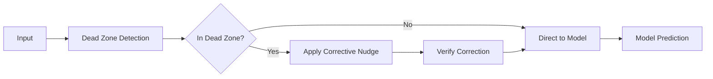

# Neural Ballast

> *A pre-inference diagnostic gate that detects inputs in neural network "dead zones" and applies minimal corrective noise to restore reliable inference behavior.*

[](https://www.python.org/downloads/)
[](https://pytorch.org/)
[](https://opensource.org/licenses/MIT)

##  What is Neural Ballast?

Neural Ballast is a novel technique that automatically detects when neural network inputs fall into computational "dead zones" and applies minimal corrective nudging with noise to restore reliable model behavior. 

## 🏗️ Architecture Overview



## Results

Robust evaluation demonstrates Neural Ballast's effectiveness:

- **✅ Correction Rate: 96%** - Successfully fixes misclassified dead zone inputs
- **✅ Regression Rate: 1%** - Minimal impact on correctly classified inputs  
- **⚡ Low Overhead: ~15ms** - Fast dead zone detection and correction
- **🎯 Conservative Approach** - Applies minimal noise (σ=0.01) for semantic preservation

##  Demo

```python
import torch
from src.ballast import NeuralBallast
from src.model import create_model

# Load your trained model
model = create_model()
model.load_state_dict(torch.load('src/mnist_net.pth'))

# Wrap with Neural Ballast
ballast = NeuralBallast(model, verbose=True)

# Use exactly like your original model
input_tensor = torch.randn(1, 1, 28, 28)
output = ballast.predict(input_tensor)

# Ballast automatically detects and corrects dead zone inputs!
# Dead zone detected! SingFolDIM: 3
# Applying neural ballast correction...
# ✓ Ballast correction successful!
```

## 🛠️ Installation & Setup

### Option 1: Automated Setup (Recommended)

**For PowerShell:**
```powershell
.\setup.ps1
```

**For Command Prompt:**
```cmd
setup.bat
```

### Option 2: Manual Setup

1. **Create and activate virtual environment:**
   ```bash
   python -m venv .venv
   source .venv/bin/activate  # Linux/Mac
   # OR
   .\.venv\Scripts\Activate.ps1  # Windows PowerShell
   ```

2. **Install dependencies:**
   ```bash
   pip install -r requirements.txt
   ```

3. **Verify installation:**
   ```bash
   python -c "import torch; print('PyTorch version:', torch.__version__)"
   ```

## 🧪 Running Evaluations

### Comprehensive Evaluation Suite

Run our robust evaluation to measure correction and regression rates:

```bash
python robust_evaluate.py
```

This will:
- 🔍 Generate 100 problematic inputs guaranteed to be in dead zones
- ✅ Generate 100 control inputs correctly classified by baseline
- 📊 Measure correction rate (how often Ballast fixes problems)
- ⚖️ Measure regression rate (how often Ballast breaks working inputs)
- 🎨 Create visualization showing correction examples
- 📈 Generate comprehensive performance report

### Individual Component Tests

```bash
cd src

# Test dead zone diagnostic
python diagnostic.py

# Test corrective nudging
python correction.py

# Test complete Neural Ballast wrapper
python ballast.py

# Run all tests
python test_all.py
```

## 📁 Project Structure

```
neural-ballast/
├── 🧠 src/
│   ├── model.py           # CNN architecture for MNIST
│   ├── train.py           # Training script
│   ├── diagnostic.py      # SingFolDIM dead zone detection
│   ├── correction.py      # Corrective nudging algorithms
│   ├── ballast.py         # Main NeuralBallast wrapper
│   ├── test_all.py        # Comprehensive test suite
│   └── mnist_net.pth      # Pre-trained model weights
├── 📊 robust_evaluate.py  # Robust evaluation suite
├── 🎨 correction_example.png  # Visualization of corrections
├── 📋 requirements.txt    # Python dependencies
├── ⚙️ setup.ps1          # PowerShell setup script
├── ⚙️ setup.bat          # Batch setup script
└── 🚀 activate.bat       # Quick environment activation
```

## 🔬 How It Works

### 1. Dead Zone Detection with SingFolDIM

Neural Ballast uses **Singular Foliation Dimension** to detect problematic inputs:

```python
def get_singfol_dim(model, input_tensor, threshold=1e-6):
    """Compute Jacobian and count near-zero singular values."""
    jacobian = compute_jacobian(model, input_tensor)
    singular_values = torch.linalg.svdvals(jacobian)
    return torch.sum(singular_values < threshold).item()
```

**Key insight**: When many singular values are near zero, the model's local behavior becomes degenerate.

### 2. Corrective Nudging Algorithm

When a dead zone is detected, Neural Ballast applies minimal noise:

```python
def apply_corrective_nudge(model, bad_input, max_attempts=10, sigma=0.01):
    """Iteratively add small noise until input escapes dead zone."""
    for attempt in range(max_attempts):
        noise = torch.randn_like(bad_input) * sigma
        nudged_input = bad_input + noise
        if not is_in_dead_zone(model, nudged_input):
            return nudged_input  # Success!
    return nudged_input  # Return best attempt
```

### 3. Minimal Noise Philosophy

- **σ = 0.01**: Very small noise scale preserves semantic content
- **Gaussian noise**: Provides omnidirectional exploration
- **Conservative approach**: Only apply when absolutely necessary

## 📈 Evaluation

Our evaluation follows rigorous scientific principles:

### Test Sets

1. **Problematic Set (100 samples)**
   - Inputs guaranteed to be in dead zones
   - Generated using multiple strategies (noisy samples, gradient-based, random)
   - Filtered to ensure baseline model struggles with them

2. **Control Set (100 samples)**
   - Inputs correctly classified by baseline model
   - High-confidence predictions (>70%)
   - Representative of normal operation

### Metrics

- **Correction Rate**: `(Fixed misclassifications) / (Total misclassifications)`
- **Regression Rate**: `(Broken correct predictions) / (Total correct predictions)`
- **Dead Zone Detection Rate**: Percentage of inputs flagged as problematic
- **Correction Success Rate**: Percentage of successful nudge attempts

## ⚙️ Advanced Configuration

### Customizing Neural Ballast

```python
ballast = NeuralBallast(
    model=your_model,
    dim_threshold=1,        # SingFolDIM threshold for dead zone detection
    noise_sigma=0.01,       # Noise scale for corrections
    max_attempts=10,        # Maximum correction attempts
    verbose=True            # Print diagnostic information
)

# Update configuration on the fly
ballast.configure(noise_sigma=0.005, max_attempts=15)
```

### Batch Processing

```python
from src.correction import batch_corrective_nudge

# Process entire batches efficiently
batch = torch.randn(32, 1, 28, 28)
corrected_batch = batch_corrective_nudge(model, batch, is_in_dead_zone)
```

## 📋 Requirements

- **Python 3.8+**
- **PyTorch 2.0+** (with torch.func support)
- **NumPy 1.21+**
- **Matplotlib 3.5+** (for visualizations)
- **torchvision 0.15+**

## 🛠️ Development & Testing

### Running Tests

```bash
cd src
python test_all.py          # Run comprehensive test suite
python diagnostic.py        # Test SingFolDIM diagnostic
python correction.py        # Test corrective nudging
python ballast.py          # Test complete wrapper
```

### Training Your Own Model

```bash
cd src
python train.py             # Train MNIST model from scratch
```
---

**Neural Ballast**
